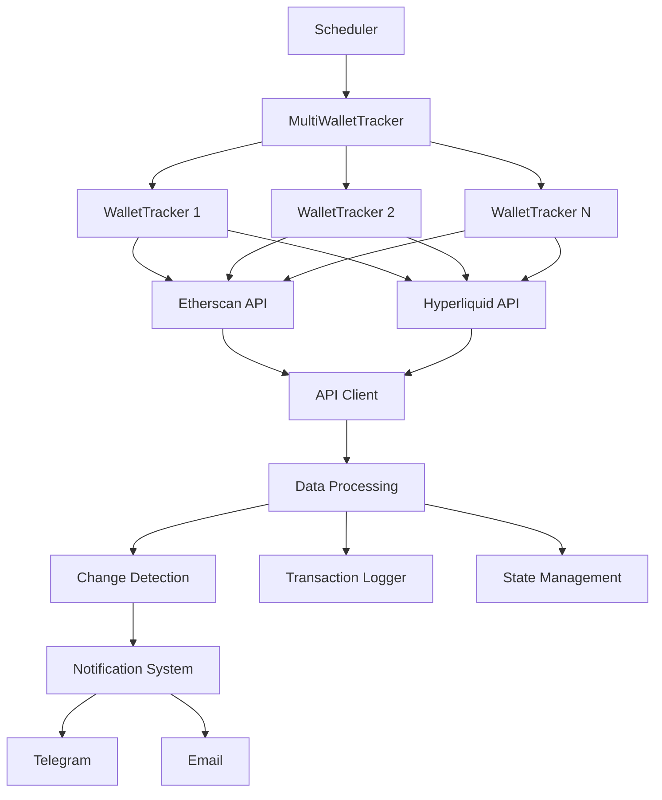

# 🛠️ Balina2Droid Geliştirici Rehberi

> Kapsamlı geliştirme, katkı ve extension rehberi

## 🎯 Bu Rehber Kimin İçin?

- **Geliştiriciler** - Projeye katkıda bulunmak isteyenler
- **Integratörler** - Sistemlerini Balina2Droid ile entegre etmek isteyenler
- **Extension Geliştiricileri** - Yeni özellikler eklemek isteyenler
- **DevOps Mühendisleri** - Deployment ve yönetim sorumluları

## 🏗️ Proje Mimarisi

### **Katmanlı Mimari**

```
┌─────────────────────────────────────────────────────────────┐
│                    PRESENTATION LAYER                        │
│  ┌─────────────┐  ┌─────────────┐  ┌─────────────────────┐ │
│  │ CLI Interface│  │   API       │  │   Web Dashboard     │ │
│  │   (main.py)  │  │ Gateway     │  │   (Future)          │ │
│  └─────────────┘  └─────────────┘  └─────────────────────┘ │
└─────────────────────────────────────────────────────────────┘
                                │
┌─────────────────────────────────────────────────────────────┐
│                    BUSINESS LOGIC LAYER                      │
│  ┌─────────────┐  ┌─────────────┐  ┌─────────────────────┐ │
│  │MultiWallet  │  │ Wallet      │  │ Notification        │ │
│  │Tracker      │  │ Tracker     │  │ System              │ │
│  │             │  │             │  │                     │ │
│  │ - Orchestrate│  │ - API Calls │  │ - Telegram          │ │
│  │ - Aggregate │  │ - Validation │  │ - Email             │ │
│  │ - Coordinate │  │ - Caching   │  │ - Formatting        │ │
│  └─────────────┘  └─────────────┘  └─────────────────────┘ │
└─────────────────────────────────────────────────────────────┘
                                │
┌─────────────────────────────────────────────────────────────┐
│                     INFRASTRUCTURE LAYER                     │
│  ┌─────────────┐  ┌─────────────┐  ┌─────────────────────┐ │
│  │ API Client  │  │ Logger      │  │ Exception           │ │
│  │             │  │ System      │  │ Handler             │ │
│  │ - Retry     │  │ - Colored   │  │ - Context           │ │
│  │ - Rate Limit│  │ - Files     │  │ - Recovery          │ │
│  │ - Timeout   │  │ - Levels    │  │ - Validation        │ │
│  └─────────────┘  └─────────────┘  └─────────────────────┘ │
└─────────────────────────────────────────────────────────────┘
```

### **Veri Akışı**



---

## 🔧 Geliştirme Ortamı Kurulumu

### **Gereksinimler**

```bash
# Python sürümü
python3 --version  # 3.7+

# Geliştirme araçları
pip install --upgrade pip
pip install black flake8 pytest pytest-cov pre-commit

# İsteğe bağlı araçlar
pip install mypy pydocstyle bandit
```

### **Development Kurulumu**

```bash
# 1. Repo klonla
git clone https://github.com/stvowns/balina2.git
cd balina2droid

# 2. Sanal ortam oluştur
python3 -m venv venv
source venv/bin/activate  # Linux/Mac
# venv\Scripts\activate     # Windows

# 3. Geliştirme bağımlılıkları
pip install -r requirements.txt
pip install -r requirements-dev.txt  # Geliştirme için ek paketler

# 4. Pre-commit hooks
pre-commit install
```

### **IDE Konfigürasyonu**

#### **VS Code Ayarları** (.vscode/settings.json)
```json
{
    "python.defaultInterpreterPath": "./venv/bin/python",
    "python.linting.enabled": true,
    "python.linting.flake8Enabled": true,
    "python.formatting.provider": "black",
    "python.testing.pytestEnabled": true,
    "python.testing.pytestArgs": ["tests/"],
    "files.exclude": {
        "**/__pycache__": true,
        "**/venv": true
    }
}
```

#### **PyCharm Ayarları**
- **Python Interpreter**: Project venv seç
- **Code Style**: Black konfigürasyonu
- **Testing**: pytest olarak ayarla
- **Linting**: flake8 aktif et

---

## 🧪 Test Stratejisi

### **Test Türleri**

#### **1. Unit Tests**
```python
# tests/test_wallet_tracker.py
import pytest
from unittest.mock import Mock, patch
from wallet_tracker import WalletTracker

class TestWalletTracker:
    def test_init(self):
        """Test wallet tracker initialization"""
        tracker = WalletTracker("0x123...", "api_key")
        assert tracker.wallet_address == "0x123..."
        assert tracker.etherscan_api_key == "api_key"

    @patch('wallet_tracker.APIClient')
    def test_get_eth_balance(self, mock_client):
        """Test ETH balance retrieval"""
        mock_client.return_value.get.return_value = {"result": "1000000000000000000"}

        tracker = WalletTracker("0x123...", "api_key")
        balance = tracker.get_eth_balance()

        assert balance == 1.0
        mock_client.return_value.get.assert_called_once()
```

#### **2. Integration Tests**
```python
# tests/test_integration.py
import pytest
from multi_wallet_tracker import MultiWalletTracker

class TestIntegration:
    def test_full_wallet_check(self):
        """Test complete wallet checking workflow"""
        config = {
            "wallets": {
                "test": {
                    "address": "0x742d35Cc6634C0532925a3b8D4C9db96C4b4Db45",
                    "name": "Test Wallet",
                    "enabled": True
                }
            },
            "etherscan_api_key": "test_key"
        }

        tracker = MultiWalletTracker(config)
        results = tracker.check_all_wallets()

        assert "test" in results
        assert isinstance(results["test"], list)
```

#### **3. End-to-End Tests**
```python
# tests/test_e2e.py
import pytest
from main import CryptoWalletMonitor

class TestE2E:
    def test_monitoring_workflow(self):
        """Test complete monitoring workflow"""
        monitor = CryptoWalletMonitor()
        results = monitor.multi_tracker.check_all_wallets()

        # Verify results structure
        assert isinstance(results, dict)
        # Verify notification sending
        # Verify logging
```

### **Test Çalıştırma**

```bash
# Tüm testler
pytest

# Coverage ile
pytest --cov=balina2droid --cov-report=html

# Spesifik test dosyası
pytest tests/test_wallet_tracker.py

# Debug modunda
pytest -v -s tests/test_wallet_tracker.py::TestWalletTracker::test_get_eth_balance

# Performance testleri
pytest tests/test_performance.py --benchmark-only
```

### **Mock Kullanımı**

```python
# API yanıtlarını mock'leme
from unittest.mock import Mock, patch

@pytest.fixture
def mock_etherscan_response():
    return {
        "status": "1",
        "result": "1000000000000000000"
    }

@patch('wallet_tracker.APIClient')
def test_with_mock_api(mock_client, mock_etherscan_response):
    mock_client.return_value.get.return_value = mock_etherscan_response

    tracker = WalletTracker("0x123...", "api_key")
    balance = tracker.get_eth_balance()

    assert balance == 1.0
```

---

## 🔌 Extension Geliştirme

### **1. Yeni Bildirim Kanalı Ekleme**

#### **Notification Provider Interface**
```python
# notifications/base.py
from abc import ABC, abstractmethod
from typing import Dict, Any

class NotificationProvider(ABC):
    @abstractmethod
    def send_notification(self, message: str, title: str, **kwargs) -> bool:
        """Send notification through this channel"""
        pass

    @abstractmethod
    def is_configured(self) -> bool:
        """Check if provider is properly configured"""
        pass

    @abstractmethod
    def test_connection(self) -> bool:
        """Test connection to notification service"""
        pass
```

#### **Discord Provider Örneği**
```python
# notifications/discord.py
import requests
from .base import NotificationProvider
from exceptions import NotificationError
from logger_config import get_logger

class DiscordNotificationProvider(NotificationProvider):
    def __init__(self, webhook_url: str, config: Dict[str, Any] = None):
        self.webhook_url = webhook_url
        self.config = config or {}
        self.logger = get_logger('discord_notifications')

    def send_notification(self, message: str, title: str, **kwargs) -> bool:
        try:
            payload = {
                "username": "Balina2Droid",
                "embeds": [{
                    "title": title,
                    "description": message,
                    "color": kwargs.get('color', 0x00ff00)
                }]
            }

            response = requests.post(self.webhook_url, json=payload, timeout=10)
            response.raise_for_status()

            self.logger.info("Discord notification sent successfully")
            return True

        except Exception as e:
            self.logger.error(f"Discord notification failed: {e}")
            raise NotificationError(f"Discord notification failed: {e}")

    def is_configured(self) -> bool:
        return bool(self.webhook_url and self.webhook_url.startswith('https://discord.com/api/webhooks/'))

    def test_connection(self) -> bool:
        try:
            return self.send_notification("Test message", "Connection Test")
        except:
            return False
```

#### **Provider Entegrasyonu**
```python
# notification_system.py (modifikasyon)
from notifications.discord import DiscordNotificationProvider

class NotificationSystem:
    def __init__(self, config: Dict[str, Any]):
        self.providers = {}
        self._setup_providers(config)

    def _setup_providers(self, config: Dict[str, Any]):
        # Existing providers
        if config.get('telegram', {}).get('enabled'):
            self.providers['telegram'] = TelegramProvider(config['telegram'])

        if config.get('email', {}).get('enabled'):
            self.providers['email'] = EmailProvider(config['email'])

        # New Discord provider
        if config.get('discord', {}).get('enabled'):
            discord_config = config['discord']
            self.providers['discord'] = DiscordNotificationProvider(
                discord_config['webhook_url'],
                discord_config
            )

    def send_notification(self, message: str, title: str) -> bool:
        """Send notification through all configured providers"""
        success_count = 0

        for provider_name, provider in self.providers.items():
            try:
                if provider.send_notification(message, title):
                    success_count += 1
            except Exception as e:
                self.logger.error(f"Provider {provider_name} failed: {e}")

        return success_count > 0
```

### **2. Yeni Veri Kaynağı Ekleme**

#### **Data Source Interface**
```python
# data_sources/base.py
from abc import ABC, abstractmethod
from typing import Dict, Any, List

class DataSource(ABC):
    @abstractmethod
    def get_balance(self, address: str) -> Optional[float]:
        """Get token balance for address"""
        pass

    @abstractmethod
    def get_transactions(self, address: str, limit: int = 10) -> List[Dict]:
        """Get recent transactions"""
        pass

    @abstractmethod
    def is_supported(self, address: str) -> bool:
        """Check if this data source supports the address"""
        pass
```

#### **Solana Data Source Örneği**
```python
# data_sources/solana.py
from .base import DataSource
from api_client import APIClient
from logger_config import get_logger

class SolanaDataSource(DataSource):
    def __init__(self, rpc_url: str):
        self.rpc_url = rpc_url
        self.client = APIClient(rpc_url)
        self.logger = get_logger('solana_data_source')

    def get_balance(self, address: str) -> Optional[float]:
        try:
            response = self.client.post("", {
                "jsonrpc": "2.0",
                "id": 1,
                "method": "getBalance",
                "params": [address]
            })

            if response.get("result"):
                lamports = response["result"]["value"]
                return lamports / 1e9  # Convert lamports to SOL

            return None

        except Exception as e:
            self.logger.error(f"Failed to get Solana balance: {e}")
            return None

    def get_transactions(self, address: str, limit: int = 10) -> List[Dict]:
        # Implementation for Solana transactions
        pass

    def is_supported(self, address: str) -> bool:
        # Check if address is valid Solana address
        return len(address) == 44 and address.endswith('solana' or 'lp')
```

### **3. Custom Validation Rules**

```python
# validation/custom_rules.py
from typing import Dict, Any, List
from abc import ABC, abstractmethod

class ValidationRule(ABC):
    @abstractmethod
    def validate(self, transaction: Dict[str, Any]) -> bool:
        """Return True if transaction passes validation"""
        pass

    @abstractmethod
    def get_reason(self, transaction: Dict[str, Any]) -> str:
        """Get reason for validation failure"""
        pass

class HighValueTransferRule(ValidationRule):
    def __init__(self, threshold_eth: float = 10.0):
        self.threshold = threshold_eth

    def validate(self, transaction: Dict[str, Any]) -> bool:
        value_eth = float(transaction.get("value", 0)) / 1e18
        return value_eth <= self.threshold

    def get_reason(self, transaction: Dict[str, Any]) -> str:
        value_eth = float(transaction.get("value", 0)) / 1e18
        return f"High value transfer detected: {value_eth} ETH > {self.threshold} ETH threshold"

class SuspiciousAddressRule(ValidationRule):
    def __init__(self, suspicious_addresses: List[str]):
        self.suspicious_addresses = set(suspicious_addresses)

    def validate(self, transaction: Dict[str, Any]) -> bool:
        to_address = transaction.get("to", "").lower()
        from_address = transaction.get("from", "").lower()

        return (to_address not in self.suspicious_addresses and
                from_address not in self.suspicious_addresses)

    def get_reason(self, transaction: Dict[str, Any]) -> str:
        return "Transaction involves suspicious address"

# Usage in WalletTracker
class WalletTracker:
    def __init__(self, wallet_address: str, etherscan_api_key: str):
        # ... existing initialization
        self.validation_rules = [
            HighValueTransferRule(threshold_eth=50.0),
            SuspiciousAddressRule([
                "0x123...",  # Known mixer address
                "0x456...",  # Suspicious address
            ])
        ]

    def _validate_transaction(self, transaction: Dict[str, Any]) -> bool:
        for rule in self.validation_rules:
            if not rule.validate(transaction):
                self.logger.warning(f"Transaction validation failed: {rule.get_reason(transaction)}")
                return False
        return True
```

---

## 🚀 Performance Optimizasyonu

### **1. API Call Optimizasyonu**

#### **Batch Requests**
```python
# optimized/api_client.py
import asyncio
import aiohttp
from typing import List, Dict, Any

class AsyncAPIClient:
    def __init__(self, base_url: str, max_concurrent: int = 10):
        self.base_url = base_url
        self.semaphore = asyncio.Semaphore(max_concurrent)

    async def get_multiple(self, endpoints: List[str]) -> List[Dict[str, Any]]:
        """Make multiple concurrent GET requests"""
        async with aiohttp.ClientSession() as session:
            tasks = [
                self._single_get(session, endpoint)
                for endpoint in endpoints
            ]
            return await asyncio.gather(*tasks, return_exceptions=True)

    async def _single_get(self, session: aiohttp.ClientSession, endpoint: str) -> Dict[str, Any]:
        async with self.semaphore:
            async with session.get(f"{self.base_url}/{endpoint}") as response:
                return await response.json()

# Usage in MultiWalletTracker
async def check_all_wallets_async(self):
    endpoints = [
        f"api?address={wallet_config['address']}&action=balance"
        for wallet_config in self.wallets.values()
        if wallet_config.get("enabled", True)
    ]

    client = AsyncAPIClient("https://api.etherscan.io")
    results = await client.get_multiple(endpoints)

    # Process results
    return self._process_batch_results(results)
```

#### **Caching Stratejisi**
```python
# cache/memory_cache.py
import time
from typing import Any, Optional
from dataclasses import dataclass

@dataclass
class CacheEntry:
    value: Any
    timestamp: float
    ttl: float

    def is_expired(self) -> bool:
        return time.time() > self.timestamp + self.ttl

class MemoryCache:
    def __init__(self, max_size: int = 1000):
        self.cache: Dict[str, CacheEntry] = {}
        self.max_size = max_size

    def get(self, key: str) -> Optional[Any]:
        entry = self.cache.get(key)
        if entry and not entry.is_expired():
            return entry.value
        elif entry:
            del self.cache[key]
        return None

    def set(self, key: str, value: Any, ttl: float = 300) -> None:
        # LRU eviction if cache is full
        if len(self.cache) >= self.max_size:
            oldest_key = min(self.cache.keys(),
                           key=lambda k: self.cache[k].timestamp)
            del self.cache[oldest_key]

        self.cache[key] = CacheEntry(value, time.time(), ttl)

    def clear_expired(self) -> int:
        expired_keys = [
            key for key, entry in self.cache.items()
            if entry.is_expired()
        ]
        for key in expired_keys:
            del self.cache[key]
        return len(expired_keys)

# Integration with WalletTracker
class WalletTracker:
    def __init__(self, wallet_address: str, etherscan_api_key: str):
        # ... existing initialization
        self.cache = MemoryCache()

    def get_eth_balance(self) -> Optional[float]:
        cache_key = f"balance:{self.wallet_address}"

        # Try cache first
        cached_balance = self.cache.get(cache_key)
        if cached_balance is not None:
            return cached_balance

        # Fetch from API
        balance = self._fetch_balance_from_api()

        # Cache for 5 minutes
        if balance is not None:
            self.cache.set(cache_key, balance, ttl=300)

        return balance
```

### **2. Memory Optimizasyonu**

#### **Object Pool Pattern**
```python
# utils/object_pool.py
from typing import TypeVar, Generic, List
import threading

T = TypeVar('T')

class ObjectPool(Generic[T], threading.local):
    def __init__(self, factory, max_size: int = 100):
        self.factory = factory
        self.max_size = max_size
        self.pool: List[T] = []
        self.lock = threading.Lock()

    def get(self) -> T:
        with self.lock:
            if self.pool:
                return self.pool.pop()
            return self.factory()

    def put(self, obj: T) -> None:
        with self.lock:
            if len(self.pool) < self.max_size:
                self.pool.append(obj)

    def clear(self) -> None:
        with self.lock:
            self.pool.clear()

# Usage for expensive objects
class RequestSessionPool:
    def __init__(self):
        self.session_pool = ObjectPool(
            factory=lambda: requests.Session(),
            max_size=10
        )

    def get_session(self):
        return self.session_pool.get()

    def return_session(self, session):
        # Reset session if needed
        self.session_pool.put(session)
```

### **3. Database Integration**

#### **SQLite Integration**
```python
# storage/database.py
import sqlite3
from typing import Dict, Any, List
from contextlib import contextmanager
from dataclasses import asdict

class DatabaseManager:
    def __init__(self, db_path: str = "balina2droid.db"):
        self.db_path = db_path
        self._init_database()

    def _init_database(self):
        with self.get_connection() as conn:
            conn.execute("""
                CREATE TABLE IF NOT EXISTS transactions (
                    id INTEGER PRIMARY KEY AUTOINCREMENT,
                    wallet_id TEXT NOT NULL,
                    transaction_hash TEXT UNIQUE,
                    block_number INTEGER,
                    timestamp DATETIME,
                    from_address TEXT,
                    to_address TEXT,
                    value TEXT,
                    gas_used INTEGER,
                    gas_price TEXT,
                    transaction_type TEXT,
                    created_at DATETIME DEFAULT CURRENT_TIMESTAMP
                )
            """)

            conn.execute("""
                CREATE INDEX IF NOT EXISTS idx_wallet_transactions
                ON transactions(wallet_id, timestamp)
            """)

    @contextmanager
    def get_connection(self):
        conn = sqlite3.connect(self.db_path)
        conn.row_factory = sqlite3.Row
        try:
            yield conn
            conn.commit()
        except Exception:
            conn.rollback()
            raise
        finally:
            conn.close()

    def save_transaction(self, wallet_id: str, transaction: Dict[str, Any]) -> bool:
        try:
            with self.get_connection() as conn:
                conn.execute("""
                    INSERT OR IGNORE INTO transactions
                    (wallet_id, transaction_hash, block_number, timestamp,
                     from_address, to_address, value, gas_used, gas_price, transaction_type)
                    VALUES (?, ?, ?, ?, ?, ?, ?, ?, ?, ?)
                """, (
                    wallet_id,
                    transaction.get('hash'),
                    transaction.get('block_number'),
                    transaction.get('timestamp'),
                    transaction.get('from'),
                    transaction.get('to'),
                    str(transaction.get('value', 0)),
                    transaction.get('gas_used'),
                    str(transaction.get('gas_price', 0)),
                    transaction.get('transaction_type', 'unknown')
                ))
                return True
        except Exception as e:
            logger.error(f"Failed to save transaction: {e}")
            return False

    def get_recent_transactions(self, wallet_id: str, limit: int = 100) -> List[Dict]:
        with self.get_connection() as conn:
            cursor = conn.execute("""
                SELECT * FROM transactions
                WHERE wallet_id = ?
                ORDER BY timestamp DESC
                LIMIT ?
            """, (wallet_id, limit))

            return [dict(row) for row in cursor.fetchall()]
```

---

## 🔒 Güvenlik Geliştirmeleri

### **1. API Key Management**

#### **Encrypted Configuration**
```python
# security/encryption.py
from cryptography.fernet import Fernet
import os
import base64
from typing import Dict, Any

class ConfigEncryption:
    def __init__(self, key_file: str = ".encryption_key"):
        self.key_file = key_file
        self.key = self._load_or_create_key()
        self.cipher = Fernet(self.key)

    def _load_or_create_key(self) -> bytes:
        if os.path.exists(self.key_file):
            with open(self.key_file, 'rb') as f:
                return f.read()
        else:
            key = Fernet.generate_key()
            with open(self.key_file, 'wb') as f:
                f.write(key)
            os.chmod(self.key_file, 0o600)  # Only owner can read/write
            return key

    def encrypt_value(self, value: str) -> str:
        encrypted = self.cipher.encrypt(value.encode())
        return base64.b64encode(encrypted).decode()

    def decrypt_value(self, encrypted_value: str) -> str:
        encrypted_bytes = base64.b64decode(encrypted_value.encode())
        decrypted = self.cipher.decrypt(encrypted_bytes)
        return decrypted.decode()

    def encrypt_config(self, config: Dict[str, Any]) -> Dict[str, Any]:
        encrypted_config = {}
        for key, value in config.items():
            if any(sensitive in key.lower() for sensitive in ['key', 'password', 'token', 'secret']):
                encrypted_config[key] = self.encrypt_value(str(value))
            else:
                encrypted_config[key] = value
        return encrypted_config

    def decrypt_config(self, encrypted_config: Dict[str, Any]) -> Dict[str, Any]:
        config = {}
        for key, value in encrypted_config.items():
            if any(sensitive in key.lower() for sensitive in ['key', 'password', 'token', 'secret']):
                config[key] = self.decrypt_value(value)
            else:
                config[key] = value
        return config

# Usage
class SecureConfigLoader:
    def __init__(self):
        self.encryption = ConfigEncryption()

    def load_config(self, config_file: str = "config.encrypted") -> Dict[str, Any]:
        # Load encrypted config file
        with open(config_file, 'r') as f:
            encrypted_config = json.load(f)

        # Decrypt sensitive values
        return self.encryption.decrypt_config(encrypted_config)
```

### **2. Rate Limiting**

```python
# security/rate_limiter.py
import time
from typing import Dict, Optional
from collections import defaultdict
from threading import Lock

class RateLimiter:
    def __init__(self, max_requests: int, time_window: int):
        self.max_requests = max_requests
        self.time_window = time_window
        self.requests: Dict[str, List[float]] = defaultdict(list)
        self.lock = Lock()

    def is_allowed(self, identifier: str) -> bool:
        """Check if request is allowed for given identifier"""
        with self.lock:
            current_time = time.time()

            # Clean old requests
            self.requests[identifier] = [
                req_time for req_time in self.requests[identifier]
                if current_time - req_time < self.time_window
            ]

            # Check if under limit
            if len(self.requests[identifier]) < self.max_requests:
                self.requests[identifier].append(current_time)
                return True

            return False

    def time_until_reset(self, identifier: str) -> Optional[float]:
        """Get seconds until rate limit resets"""
        with self.lock:
            if not self.requests[identifier]:
                return None

            oldest_request = min(self.requests[identifier])
            return self.time_window - (time.time() - oldest_request)

# API client with rate limiting
class RateLimitedAPIClient(APIClient):
    def __init__(self, *args, **kwargs):
        super().__init__(*args, **kwargs)
        self.rate_limiter = RateLimiter(
            max_requests=5,  # 5 requests per minute
            time_window=60
        )

    def get(self, endpoint: str, params: Dict = None, **kwargs) -> Dict[str, Any]:
        identifier = f"{self.base_url}:{endpoint}"

        if not self.rate_limiter.is_allowed(identifier):
            wait_time = self.rate_limiter.time_until_reset(identifier)
            if wait_time:
                self.logger.warning(f"Rate limit reached, waiting {wait_time:.1f}s")
                time.sleep(wait_time)

        return super().get(endpoint, params, **kwargs)
```

### **3. Input Validation**

```python
# security/validation.py
import re
from typing import Any, Optional
from dataclasses import dataclass
from exceptions import ValidationError

@dataclass
class ValidationRule:
    pattern: str
    error_message: str

class SecurityValidator:
    # Ethereum address pattern
    ETH_ADDRESS = ValidationRule(
        pattern=r'^0x[a-fA-F0-9]{40}$',
        error_message="Invalid Ethereum address format"
    )

    # API key pattern (alphanumeric, underscore, hyphen)
    API_KEY = ValidationRule(
        pattern=r'^[a-zA-Z0-9_-]+$',
        error_message="Invalid API key format"
    )

    # Telegram chat ID pattern (numeric)
    TELEGRAM_CHAT_ID = ValidationRule(
        pattern=r'^\d+$',
        error_message="Invalid Telegram chat ID format"
    )

    @staticmethod
    def validate(value: str, rule: ValidationRule) -> bool:
        if not re.match(rule.pattern, value):
            raise ValidationError(f"{rule.error_message}: {value}")
        return True

    @staticmethod
    def validate_ethereum_address(address: str) -> bool:
        return SecurityValidator.validate(address, SecurityValidator.ETH_ADDRESS)

    @staticmethod
    def validate_api_key(api_key: str) -> bool:
        if len(api_key) < 10:
            raise ValidationError("API key too short (minimum 10 characters)")
        return SecurityValidator.validate(api_key, SecurityValidator.API_KEY)

    @staticmethod
    def sanitize_input(input_string: str) -> str:
        """Remove potentially dangerous characters"""
        # Remove null bytes and control characters
        sanitized = re.sub(r'[\x00-\x1f\x7f]', '', input_string)

        # Limit length
        if len(sanitized) > 1000:
            raise ValidationError("Input too long (maximum 1000 characters)")

        return sanitized.strip()
```

---

## 📊 Monitoring ve Observability

### **1. Metrics Collection**

```python
# monitoring/metrics.py
import time
import psutil
from typing import Dict, Any
from dataclasses import dataclass, field
from threading import Lock

@dataclass
class Metrics:
    api_calls: int = 0
    successful_calls: int = 0
    failed_calls: int = 0
    notifications_sent: int = 0
    wallets_monitored: int = 0
    uptime: float = field(default_factory=time.time)
    last_check: float = field(default_factory=time.time)
    memory_usage: float = 0.0
    cpu_usage: float = 0.0

class MetricsCollector:
    def __init__(self):
        self.metrics = Metrics()
        self.lock = Lock()
        self.start_time = time.time()

    def record_api_call(self, success: bool):
        with self.lock:
            self.metrics.api_calls += 1
            if success:
                self.metrics.successful_calls += 1
            else:
                self.metrics.failed_calls += 1

    def record_notification(self):
        with self.lock:
            self.metrics.notifications_sent += 1

    def record_wallet_check(self, wallet_count: int):
        with self.lock:
            self.metrics.wallets_monitored = wallet_count
            self.metrics.last_check = time.time()

    def update_system_metrics(self):
        with self.lock:
            process = psutil.Process()
            self.metrics.memory_usage = process.memory_info().rss / 1024 / 1024  # MB
            self.metrics.cpu_usage = process.cpu_percent()
            self.metrics.uptime = time.time() - self.start_time

    def get_metrics(self) -> Dict[str, Any]:
        self.update_system_metrics()

        with self.lock:
            return {
                "api_calls": self.metrics.api_calls,
                "success_rate": (
                    self.metrics.successful_calls / max(self.metrics.api_calls, 1) * 100
                ),
                "notifications_sent": self.metrics.notifications_sent,
                "wallets_monitored": self.metrics.wallets_monitored,
                "uptime_seconds": self.metrics.uptime,
                "memory_usage_mb": self.metrics.memory_usage,
                "cpu_usage_percent": self.metrics.cpu_usage,
                "last_check": self.metrics.last_check
            }

# Global metrics instance
metrics = MetricsCollector()
```

### **2. Health Check Endpoint**

```python
# monitoring/health.py
from typing import Dict, Any
import time
from metrics import metrics
from logger_config import get_logger

class HealthChecker:
    def __init__(self):
        self.logger = get_logger('health')

    def check_dependencies(self) -> Dict[str, bool]:
        """Check health of external dependencies"""
        status = {}

        # Check Etherscan API
        try:
            from api_client import APIClient
            client = APIClient("https://api.etherscan.io")
            response = client.get("api", params={"action": "eth_blockNumber"})
            status['etherscan_api'] = response.get('status') == '1'
        except Exception as e:
            self.logger.error(f"Etherscan health check failed: {e}")
            status['etherscan_api'] = False

        # Check Telegram bot
        try:
            from notification_system import NotificationSystem
            # Test with minimal config
            test_config = {
                'telegram': {
                    'enabled': False  # Don't actually send
                }
            }
            telegram_system = NotificationSystem(test_config)
            status['telegram_bot'] = True
        except Exception as e:
            self.logger.error(f"Telegram health check failed: {e}")
            status['telegram_bot'] = False

        return status

    def check_system_health(self) -> Dict[str, Any]:
        """Overall system health check"""
        dependencies = self.check_dependencies()
        system_metrics = metrics.get_metrics()

        # Determine overall health
        all_healthy = all(dependencies.values())

        return {
            "status": "healthy" if all_healthy else "unhealthy",
            "timestamp": time.time(),
            "dependencies": dependencies,
            "metrics": system_metrics,
            "checks": {
                "api_success_rate": system_metrics["success_rate"] > 90,
                "memory_usage_ok": system_metrics["memory_usage_mb"] < 1000,
                "cpu_usage_ok": system_metrics["cpu_usage_percent"] < 80,
                "recent_activity": (time.time() - system_metrics["last_check"]) < 3600
            }
        }
```

### **3. Alerting**

```python
# monitoring/alerts.py
from typing import List, Dict, Any
from enum import Enum
from dataclasses import dataclass
from logger_config import get_logger

class AlertSeverity(Enum):
    INFO = "info"
    WARNING = "warning"
    ERROR = "error"
    CRITICAL = "critical"

@dataclass
class Alert:
    title: str
    message: str
    severity: AlertSeverity
    timestamp: float
    source: str

class AlertManager:
    def __init__(self):
        self.logger = get_logger('alerts')
        self.alerts: List[Alert] = []
        self.alert_handlers = []

    def add_handler(self, handler):
        """Add alert handler (e.g., notification, logging)"""
        self.alert_handlers.append(handler)

    def check_alerts(self, metrics: Dict[str, Any]) -> List[Alert]:
        """Generate alerts based on metrics"""
        alerts = []

        # API success rate alert
        if metrics["success_rate"] < 80:
            alerts.append(Alert(
                title="Low API Success Rate",
                message=f"API success rate is {metrics['success_rate']:.1f}%",
                severity=AlertSeverity.WARNING,
                timestamp=time.time(),
                source="api_monitor"
            ))

        # Memory usage alert
        if metrics["memory_usage_mb"] > 500:
            alerts.append(Alert(
                title="High Memory Usage",
                message=f"Memory usage: {metrics['memory_usage_mb']:.1f} MB",
                severity=AlertSeverity.WARNING,
                timestamp=time.time(),
                source="system_monitor"
            ))

        # CPU usage alert
        if metrics["cpu_usage_percent"] > 80:
            alerts.append(Alert(
                title="High CPU Usage",
                message=f"CPU usage: {metrics['cpu_usage_percent']:.1f}%",
                severity=AlertSeverity.ERROR,
                timestamp=time.time(),
                source="system_monitor"
            ))

        # No recent activity alert
        time_since_last_check = time.time() - metrics["last_check"]
        if time_since_last_check > 7200:  # 2 hours
            alerts.append(Alert(
                title="No Recent Activity",
                message=f"Last wallet check was {time_since_last_check/3600:.1f} hours ago",
                severity=AlertSeverity.CRITICAL,
                timestamp=time.time(),
                source="activity_monitor"
            ))

        return alerts

    def send_alert(self, alert: Alert):
        """Send alert through all handlers"""
        self.alerts.append(alert)

        for handler in self.alert_handlers:
            try:
                handler(alert)
            except Exception as e:
                self.logger.error(f"Alert handler failed: {e}")

    def check_and_send_alerts(self, metrics: Dict[str, Any]):
        """Check for alerts and send them"""
        alerts = self.check_alerts(metrics)
        for alert in alerts:
            self.send_alert(alert)

# Alert handler for notifications
def notification_alert_handler(alert: Alert):
    """Send alert as notification"""
    try:
        from notification_system import NotificationSystem

        config = {
            'telegram': {
                'enabled': True,
                'bot_token': os.getenv('ALERT_BOT_TOKEN'),
                'chat_id': os.getenv('ALERT_CHAT_ID')
            }
        }

        notifier = NotificationSystem(config)

        emoji = {
            AlertSeverity.INFO: "ℹ️",
            AlertSeverity.WARNING: "⚠️",
            AlertSeverity.ERROR: "❌",
            AlertSeverity.CRITICAL: "🚨"
        }

        message = f"{emoji[alert.severity]} **{alert.title}**\n{alert.message}"
        notifier.send_notification(message, f"System Alert: {alert.severity.value.upper()}")

    except Exception as e:
        logger.error(f"Failed to send alert notification: {e}")
```

---

## 🚀 Deployment Stratejileri

### **1. Docker Deployment**

#### **Dockerfile**
```dockerfile
FROM python:3.11-slim

# Install system dependencies
RUN apt-get update && apt-get install -y \
    gcc \
    && rm -rf /var/lib/apt/lists/*

# Set working directory
WORKDIR /app

# Copy requirements and install Python dependencies
COPY requirements.txt .
RUN pip install --no-cache-dir -r requirements.txt

# Copy application code
COPY . .

# Create logs directory
RUN mkdir -p logs

# Create non-root user
RUN useradd -m -u 1000 balina2droid && \
    chown -R balina2droid:balina2droid /app
USER balina2droid

# Expose port for health checks
EXPOSE 8080

# Health check
HEALTHCHECK --interval=30s --timeout=10s --start-period=5s --retries=3 \
    CMD python -c "from monitoring.health import HealthChecker; print(HealthChecker().check_system_health()['status'])" || exit 1

# Run the application
CMD ["python", "main.py"]
```

#### **Docker Compose**
```yaml
version: '3.8'

services:
  balina2droid:
    build: .
    container_name: balina2droid
    restart: unless-stopped
    environment:
      - LOG_LEVEL=INFO
      - CHECK_INTERVAL=600
    env_file:
      - .env
    volumes:
      - ./logs:/app/logs
      - ./data:/app/data
    networks:
      - balina2droid-network
    healthcheck:
      test: ["CMD", "python", "-c", "from monitoring.health import HealthChecker; print('healthy') if HealthChecker().check_system_health()['status'] == 'healthy' else exit(1)"]
      interval: 30s
      timeout: 10s
      retries: 3
      start_period: 40s

  # Optional: Redis for caching
  redis:
    image: redis:7-alpine
    container_name: balina2droid-redis
    restart: unless-stopped
    volumes:
      - redis-data:/data
    networks:
      - balina2droid-network

networks:
  balina2droid-network:
    driver: bridge

volumes:
  redis-data:
```

### **2. Kubernetes Deployment**

```yaml
# k8s/deployment.yaml
apiVersion: apps/v1
kind: Deployment
metadata:
  name: balina2droid
  labels:
    app: balina2droid
spec:
  replicas: 1
  selector:
    matchLabels:
      app: balina2droid
  template:
    metadata:
      labels:
        app: balina2droid
    spec:
      containers:
      - name: balina2droid
        image: balina2droid:latest
        ports:
        - containerPort: 8080
        env:
        - name: LOG_LEVEL
          value: "INFO"
        - name: CHECK_INTERVAL
          value: "600"
        envFrom:
        - secretRef:
            name: balina2droid-secrets
        - configMapRef:
            name: balina2droid-config
        resources:
          requests:
            memory: "256Mi"
            cpu: "250m"
          limits:
            memory: "512Mi"
            cpu: "500m"
        livenessProbe:
          httpGet:
            path: /health
            port: 8080
          initialDelaySeconds: 30
          periodSeconds: 10
        readinessProbe:
          httpGet:
            path: /ready
            port: 8080
          initialDelaySeconds: 5
          periodSeconds: 5
        volumeMounts:
        - name: logs
          mountPath: /app/logs
      volumes:
      - name: logs
        persistentVolumeClaim:
          claimName: balina2droid-logs

---
apiVersion: v1
kind: Service
metadata:
  name: balina2droid-service
spec:
  selector:
    app: balina2droid
  ports:
  - protocol: TCP
    port: 80
    targetPort: 8080
  type: ClusterIP

---
apiVersion: v1
kind: PersistentVolumeClaim
metadata:
  name: balina2droid-logs
spec:
  accessModes:
    - ReadWriteOnce
  resources:
    requests:
      storage: 1Gi
```

### **3. CI/CD Pipeline**

#### **GitHub Actions**
```yaml
# .github/workflows/ci-cd.yml
name: CI/CD Pipeline

on:
  push:
    branches: [ main, develop ]
  pull_request:
    branches: [ main ]

jobs:
  test:
    runs-on: ubuntu-latest
    strategy:
      matrix:
        python-version: [3.8, 3.9, 3.10, 3.11]

    steps:
    - uses: actions/checkout@v3

    - name: Set up Python ${{ matrix.python-version }}
      uses: actions/setup-python@v4
      with:
        python-version: ${{ matrix.python-version }}

    - name: Install dependencies
      run: |
        python -m pip install --upgrade pip
        pip install -r requirements.txt
        pip install -r requirements-dev.txt

    - name: Lint with flake8
      run: |
        flake8 . --count --select=E9,F63,F7,F82 --show-source --statistics
        flake8 . --count --exit-zero --max-complexity=10 --max-line-length=127 --statistics

    - name: Run tests
      run: |
        pytest --cov=balina2droid --cov-report=xml

    - name: Upload coverage to Codecov
      uses: codecov/codecov-action@v3
      with:
        file: ./coverage.xml

  security:
    runs-on: ubuntu-latest
    steps:
    - uses: actions/checkout@v3

    - name: Run security scan
      run: |
        pip install bandit safety
        bandit -r . -f json -o bandit-report.json
        safety check --json --output safety-report.json

    - name: Upload security reports
      uses: actions/upload-artifact@v3
      with:
        name: security-reports
        path: |
          bandit-report.json
          safety-report.json

  build:
    needs: [test, security]
    runs-on: ubuntu-latest
    if: github.ref == 'refs/heads/main'

    steps:
    - uses: actions/checkout@v3

    - name: Set up Docker Buildx
      uses: docker/setup-buildx-action@v2

    - name: Login to Container Registry
      uses: docker/login-action@v2
      with:
        registry: ghcr.io
        username: ${{ github.actor }}
        password: ${{ secrets.GITHUB_TOKEN }}

    - name: Build and push
      uses: docker/build-push-action@v4
      with:
        context: .
        push: true
        tags: |
          ghcr.io/${{ github.repository }}:latest
          ghcr.io/${{ github.repository }}:${{ github.sha }}
        cache-from: type=gha
        cache-to: type=gha,mode=max

  deploy:
    needs: build
    runs-on: ubuntu-latest
    if: github.ref == 'refs/heads/main'
    environment: production

    steps:
    - name: Deploy to Kubernetes
      run: |
        # kubectl deployment commands
        echo "Deploying to production..."
```

---

## 📝 Kod Katkı Rehberi

### **1. Development Workflow**

```bash
# 1. Feature branch oluştur
git checkout -b feature/your-feature-name

# 2. Geliştirme yap
# ... kod değişiklikleri ...

# 3. Testleri çalıştır
pytest

# 4. Kod kalite kontrolleri
black .
flake8 .
mypy .

# 5. Commit
git add .
git commit -m "feat: add new feature description"

# 6. Push ve PR
git push origin feature/your-feature-name
# GitHub'da PR oluştur
```

### **2. Commit Message Standartı**

```
type(scope): brief description

[optional body]

[optional footer]

Types:
- feat:     New feature
- fix:      Bug fix
- docs:     Documentation changes
- style:    Formatting, missing semi colons, etc.
- refactor: Refactoring production code
- test:     Adding tests
- chore:    Updating build tasks, package manager configs, etc.

Examples:
feat(notification): add Discord notification provider
fix(wallet_tracker): handle API rate limiting properly
docs(api): update API documentation for new endpoints
```

### **3. Code Review Checklist**

#### **Functionality**
- [ ] Feature works as expected
- [ ] Edge cases handled
- [ ] Error handling implemented
- [ ] Tests cover new functionality

#### **Code Quality**
- [ ] Code follows project style
- [ ] Functions are small and focused
- [ ] No code duplication
- [ ] Proper documentation

#### **Security**
- [ ] No sensitive data in code
- [ ] Input validation implemented
- [ ] Dependencies are secure
- [ ] No hardcoded credentials

#### **Performance**
- [ ] No obvious performance issues
- [ ] Proper error handling
- [ ] Resource management
- [ ] Efficient algorithms

---

## 🔗 Faydalı Kaynaklar

### **Python Geliştirme**
- [Python Documentation](https://docs.python.org/)
- [PEP 8 Style Guide](https://pep8.org/)
- [pytest Documentation](https://docs.pytest.org/)
- [Black Code Formatter](https://black.readthedocs.io/)

### **API Geliştirme**
- [Requests Library](https://docs.python-requests.org/)
- [REST API Design](https://restfulapi.net/)
- [API Security](https://owasp.org/www-project-api-security/)

### **Testing**
- [pytest Best Practices](https://docs.pytest.org/en/stable/best.html)
- [Mock Testing](https://docs.python.org/3/library/unittest.mock.html)
- [Test Coverage](https://coverage.readthedocs.io/)

### **DevOps**
- [Docker Best Practices](https://docs.docker.com/develop/dev-best-practices/)
- [Kubernetes Documentation](https://kubernetes.io/docs/)
- [GitHub Actions](https://docs.github.com/en/actions)

---

**Bu rehber ile Balina2Droid projesine etkili bir şekilde katkıda bulunabilirsiniz. Her türlü katkı ve geri bildirim değerlidir!** 🚀